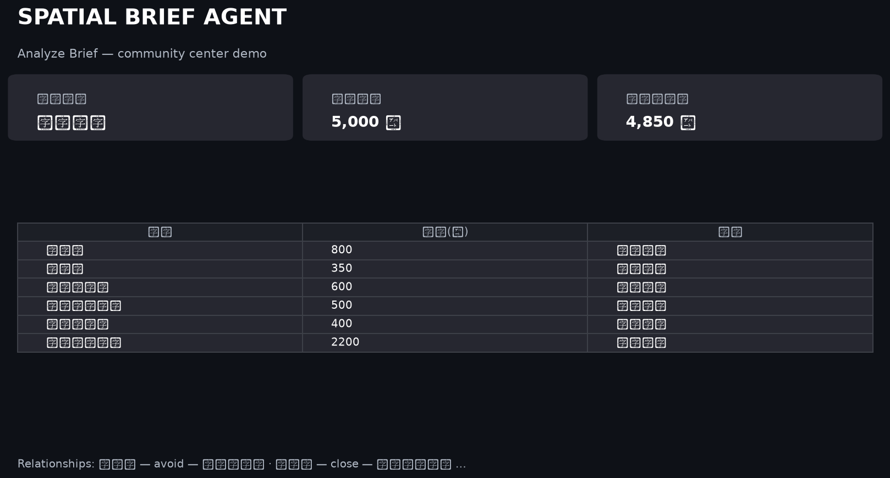
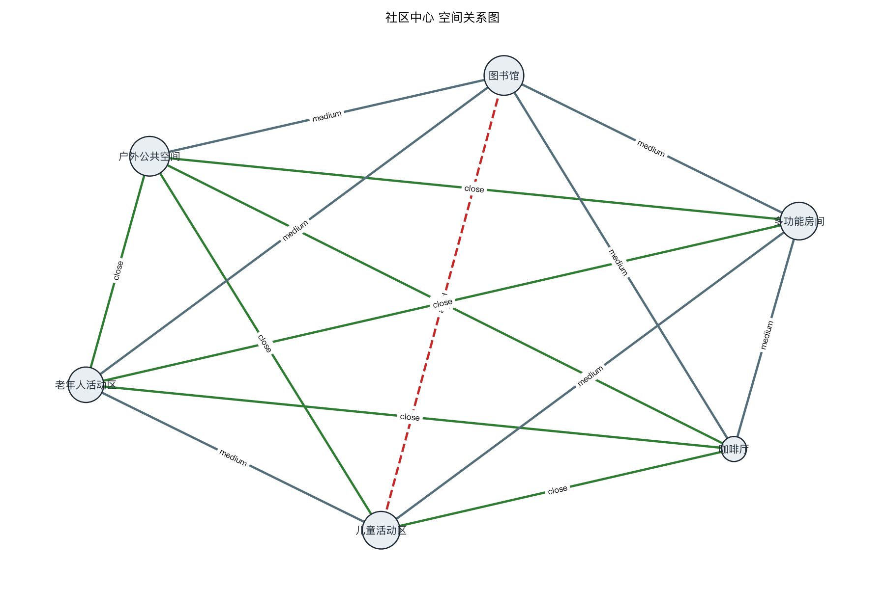
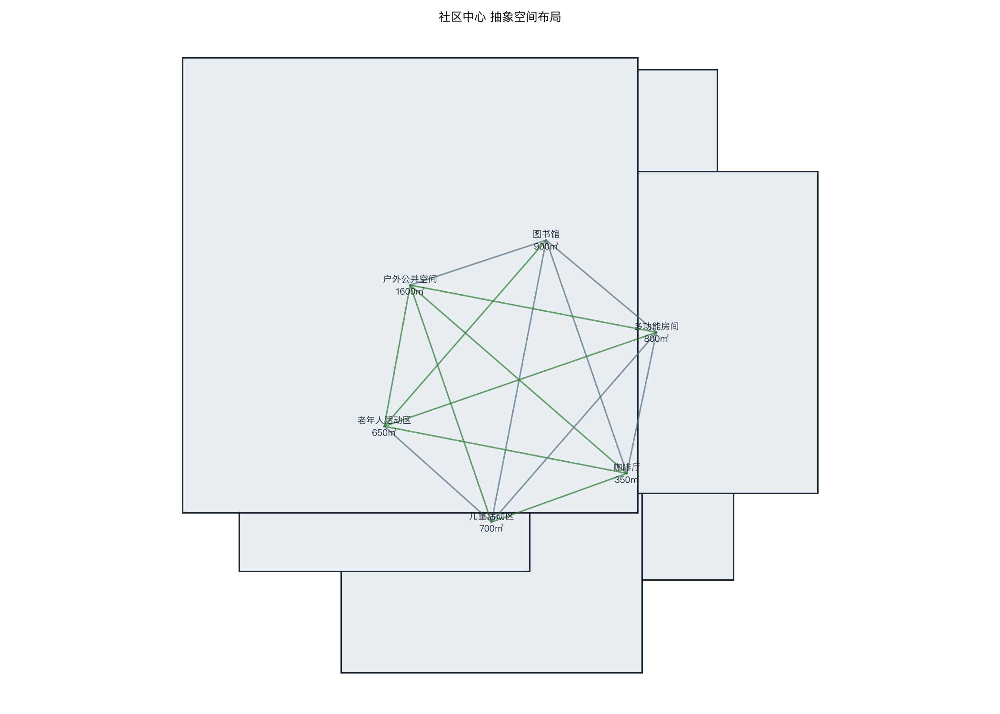

# Spatial Brief Agent — Case Study

## Problem

建筑空间策划（Architectural Programming）高度依赖分散的文字需求和非结构化的空间推理。建筑师需要从冗长的 Brief 中手动提取空间清单、判断邻接关系、检查面积约束——这个过程耗时且容易遗漏。

## Insight

- LLM 擅长理解模糊的自然语言 Brief
- 但 LLM 不可靠于确定性计算（面积加总、规则验证）
- 建筑专业知识（空间关系、噪音冲突、公私分区）可以转化为可执行的规则

## Design Principle

**Let AI reason. Let the system calculate. Let the designer decide.**

- AI 负责：理解、推理、提议
- 系统负责：计算、验证、可视化
- 设计师负责：决策、迭代、修正

## Architecture

```
User Brief
    ↓
LLM (DeepSeek) — 理解需求，输出 JSON
    ↓
Pydantic — 验证数据结构
    ↓
SpatialPlan
    ├── spaces（空间清单 + 面积）
    └── relationships（邻接关系）
    ↓
Python Rules Engine — 面积检查 + 冲突检测
    ↓
Visualization — 关系图 + 抽象布局
    ↓
Agent Loop — 用户修改 → 重算 → 刷新
    ↓
Designer
```

## Key Features

1. **Structured Output**：LLM 输出严格 JSON，Pydantic 验证，不是自由文本
2. **Deterministic Rules**：面积计算和规则检查由 Python 完成，不交给 LLM
3. **Graph-based Relationships**：空间关系建模为 Graph（Node + Edge）
4. **Agent Iteration**：用户可以用自然语言修改方案，系统自动更新

## Demo Scenario

**输入 Brief：**

> 一个 5,000㎡ 的社区中心，服务儿童、老年人和家庭，包含图书馆、咖啡厅、儿童活动区、老年人活动区、多功能房间、户外公共空间。

**系统输出：**

- 6 个空间的结构化清单（名称、面积、用途）
- 多条空间邻接关系（close / medium / far / avoid）
- 规则检查（如：图书馆与儿童活动区应为 avoid）
- 空间关系图 + 抽象布局图

**Agent 修改：**

> 用户：「把咖啡厅增加到 400㎡」  
> 系统：更新面积 → 重算总面积 → 检查是否超标 → 刷新图表

### Screenshots

| Analyze | Adjacency graph | Agent chat |
|:---:|:---:|:---:|
|  |  |  |



## What I Learned

- AI Product 不是「调 API」，而是设计 LLM + 确定性系统的协作
- 建筑领域知识可以直接变成数据模型和规则引擎
- Agent 的核心是「有状态的迭代」，不是一次性问答
## Tech Stack

Python · DeepSeek API · Pydantic · NetworkX · Matplotlib · Streamlit

## Links

- **GitHub：** https://github.com/Chunyiyie/spatial-brief-agent
- **Live Demo：** https://spatial-brief-agent.streamlit.app

## Future Work

- [ ] 更精确的布局算法（constraint programming）
- [ ] 支持上传 PDF Brief
- [ ] 多方案对比
- [ ] 导出为 Excel / PDF 报告
